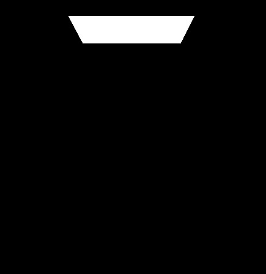
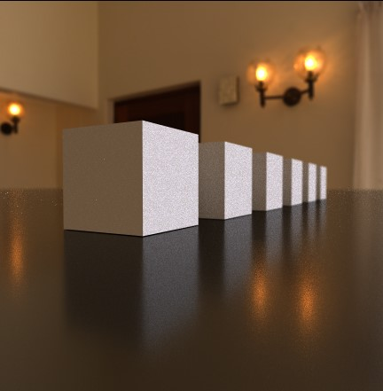
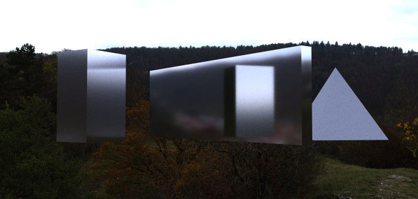
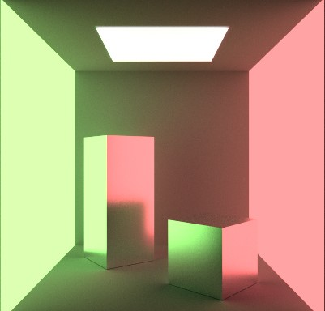

# GPU Path Tracer 

## Introduction:
	A physically based render engine running on an OpenGL compute shader. 

## Controls:

### Ray Depth
	The Ray Depth parameter controls the number of bounces the light ray emitted from the camera makes. 
depth = 1 | depth = 2 | depth = 3
--- | --- | ---
 | | 

depth = 4 | depth = 5 | depth = 6
--- | --- | ---
 | | 

### Samples
	The sample parameter controls the number of rays emitted per pixel. The light contribution of each ray is then averaged over
	the sample count. The greater the sample count the lower the noise of the output image will be.
32 samples | 64 samples | 256 samples
--- | --- | ---
 | | 

1024 samples | 4096 samples | 8192 samples
--- | --- | ---
 | | 

### Epsilon
	The Epsilon parameter denotes the minimum distance between the origin of a ray and it's Ray-World intersection. This means that 
	if the Epsilon value is equal to 0.01 then any geometry intersected by a light ray at a distance less than 0.01 from its origin
	will be ignored. It is usefull when rendering geometry with tight gaps because we can control the amount of light entering small
	crevices. 
	
0.001 | 0.5 | 1.0
--- | --- | ---
 | | 

### Camera:
The Camera Object casts rays out into the 3D scene and captures the image by evaluating 
the amount of light arriving at each pixel. The camera is free to move around within the 
3D world space.

1. Camera pan: `Middle Mouse Button`
2. Camera rotate: `Alt + Middle Mouse Button`
3. Camera zoom: `Mouse Scroll`

#### Camera Settings
##### Field of View
	The Field of View is the maximum area the camera can see. It is expressed in degrees since it defines the angle
	the camera makes with the image plane.
FOV 15 | FOV 30 | FOV 45
--- | --- | ---
 | | 

FOV 60 | FOV 75 | FOV 90
--- | --- | ---
 | | 	

##### Focus distance + Aperture
	Focus distance controls the focal length of the camera.
	Aperture controls the size of the aperture.

	These parameters can be used to create a depth of field effect. The geometry
	at a distance of focal lenght from the camera will appear sharpest in the final 
	image while everything else will appear less sharp, or more out of focus, the further
	it is from the focal plane. The size of the aperture controls the amount of light
 	that is allowed to enter the camera. The greater the aperture size the wider the
	depth of field will be.

f = 17, a = 0.8 | f = 33, a = 0.8 | f = 57, a = 0.8
--- | --- | ---
 | | 

f = 17, a = 0.1 | f = 17, a = 0.5 | f = 17, a = 1.0
--- | --- | ---
 | | 	

### Environment mapping
The path tracer supports environment mapping. More specifically we can load an equirectangular
HDR image to act as an environment light. If the light ray does not hit any geometry it will 
sample the environment image based on the ray's direction and will interpret the pixel's
value as an emissive contribution to the rendering equation.

Environment settings:
`Rotate X` 
`Rotate Y`
`Exposure`

## Materials
### Diffuse brdf
Oren-Nayar | Lambertian 
--- | --- 
 | 
The Oren-Nayar cubes have a roughness parameter of 0.0, 0.2, 0.4, 0.6, 0.8, 1.0 (from left to right) | Same as Oren-Nayar with roughness 0

### Metalic GGX brdf
Roughness | Specular 
--- | --- 
/ggxR.jpg) | /ggxS.jpg)
Roughness parameter 0.0, 0.2, 0.4, 0.6, 0.8, 1.0 (from left to right) | Specular color defines the reflected light color

### Refractive
Index Of Refraction 
--- | 
 
IOR: 0.0, 1.3, 1.5, 1.9, 2.3, 3.5 (from left to right) 

IOR 1.0 | IOR 1.3 | IOR 1.7 | IOR 2.5
--- | --- | --- | ---
 |  |  | 

### Emissive
Each material has an emissive parameter which allows the geometry to emit light.

a | b | c 
--- | --- | --- 
 |  | 

### Viewport

OpenGL raster viewport
--- | 
 

The path trace has a wireframe option for the viewport. We can use this mode to navigate the scene
without evoking the compute shader ("Shaders/RayTraceCompute.shader"). 
The wireframe rendering is done with OpenGL rasterization ("Shaders/Basic.shader")

