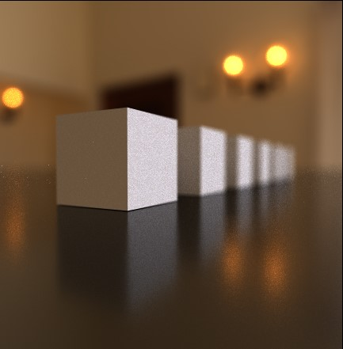

# GPU Path Tracer 

## Introduction:
	A physically based render engine running on an OpenGL compute shader. 

## Controls:

### Ray Depth
	The Ray Depth parameter controls the number of bounces the light ray emitted from the camera makes. 
depth = 1 | depth = 2 | depth = 3
--- | --- | ---
 | | 

depth = 4 | depth = 5 | depth = 6
--- | --- | ---
 | | 

### Samples
	The sample parameter controls the number of rays emitted per pixel. The light contribution of each ray is then averaged over
	the sample count. The greater the sample count the lower the noise of the output image will be.
32 samples | 64 samples | 256 samples
--- | --- | ---
 | | 

1024 samples | 4096 samples | 8192 samples
--- | --- | ---
 | | 

### Epsilon
	The Epsilon parameter denotes the minimum distance between the origin of a ray and it's Ray-World intersection. This means that 
	if the Epsilon value is equal to 0.01 then any geometry intersected by a light ray at a distance less than 0.01 from its origin
	will be ignored. It is usefull when rendering geometry with tight gaps because we can control the amount of light entering small
	crevices. 
	
0.001 | 0.5 | 1.0
--- | --- | ---
 | | 

### Camera:
The Camera Object casts rays out into the 3D scene and captures the image by evaluating 
the amount of light arriving at each pixel. The camera is free to move around within the 
3D world space.

1. Camera pan: `Middle Mouse Button`
2. Camera rotate: `Alt + Middle Mouse Button`
3. Camera zoom: `Mouse Scroll`

#### Camera Settings
##### Field of View
	The Field of View is the maximum area the camera can see. It is expressed in degrees since it defines the angle
	the camera makes with the image plane.
FOV 15 | FOV 30 | FOV 45
--- | --- | ---
 | | 

FOV 60 | FOV 75 | FOV 90
--- | --- | ---
 | | 	

##### Focus distance + Aperture
	Focus distance controls the focal length of the camera.
	Aperture controls the size of the aperture.

	These parameters can be used to create a depth of field effect. The geometry
	at a distance of focal lenght from the camera will appear sharpest in the final 
	image while everything else will appear less sharp, or more out of focus, the further
	it is from the focal plane. The size of the aperture controls the amount of light
 	that is allowed to enter the camera. The greater the aperture size the wider the
	depth of field will be.

f = 17, a = 0.8 | f = 33, a = 0.8 | f = 57, a = 0.8
--- | --- | ---
 | | 

f = 17, a = 0.1 | f = 17, a = 0.5 | f = 17, a = 1.0
--- | --- | ---
 | | 	

###Environment mapping
	The path tracer supports environment mapping. More specifically we can load an equirectangular
	HDR image to act as an environment light. If the light ray does not hit any geometry it will 
	sample the environment image based on the ray's direction and will interpret the pixel's
	value as an emissive contribution to the rendering equation.

HDRI settings:
`Rotate X` 
`Rotate Y`
`Exposure`
	
	

## How to use the plugin:
	
The Convex Hull 2D object can be found under the "Extensions" tab. 

The Convex Hull is computed on it's children object's data. The data is interpreted differently depending
on the selected mode in the object properties.There are currently two convex hull modes:
**Pivot point based** and **Geometry based**.

### Pivot point based
	By default the Convex Hull 2D object snaps it's childern objects to it's local XZ plane and
	computes convex hull on it's child objects' pivot points. The child objects are free to move around
	in Convex Hull 2D object's XZ plane.

### Geometry based
	To use Geometry based mode we need to enable it first in the Object settings by checking on
	"Geometry based" option. This mode computes the convex hull on the points produced by intersecting
	the world X-Z plane with the childern objects. Note that the children objects must be in editable
	mode to be considered for computation.
	

  
   

### Define custom plane of intersection
	We can also overwrite the default "world X-Z" plane of intersection and define a custom plane
 	of intersection for our convex hull calculations. We do so by linking any object to the "Plane
	of intersection target" linker in the Object properties. Simply create a new object
	(for example a quad polygon), drag and drop it into the link area. Once the object has been linked
	it should have a green bounding box surrounding it. The orientation and the position of the linked 
	object now defines the new orientation and center of the plane of intersection for geometry based mode.

  

  
  
  

### Bounding plane
	For a better visualization we can turn on the "Show Bounding Plane" option. This will display
	a green bounding plane of the convex hull points.

  
  
  

### Expansion
	The expansion slider allows us to expand/contract the convex hull, similar but not the same as
	to scaling it up or down. More precisely, the expansion direction is based on the sum of a point's
	tangent vectors, which are pointing to the next and previous points within the convex hull. From my
	testing this type of expansion gives the most uniform and stable results, especially when dealing with
	closed geometry. Currently the "Expansion mode" contains "Tangent Based" mode only. I am planning on
	including more modes in the future.

  
 

  
  

### Precision
	Precision parameter can be thought of as a distance threshold between two points. If the distance
	between two given points is smaller than the value of the precision parameter, then the two points
	will be considered as a single point for the convex Hull computation. By default it is set to 0.001.
	You can adjust the precision parameter based on the topology of your geometry and the respective distances
	between child objects. 
	
	Sometimes when dealing with dense geometry it could be helpful to increase the value of the precision
	parameter to increase performance of the algorithm. But as always, it is a trade off between performance and accuracy.

### Future updates
	1) Update current gift wrapping algorithm to a more efficient Graham's Scan Algorithm.
	2) Add a feature to create multiple convex hull splines along geometry by offseting current plane of intersection.
	3) Add bezier and bspline support.
	